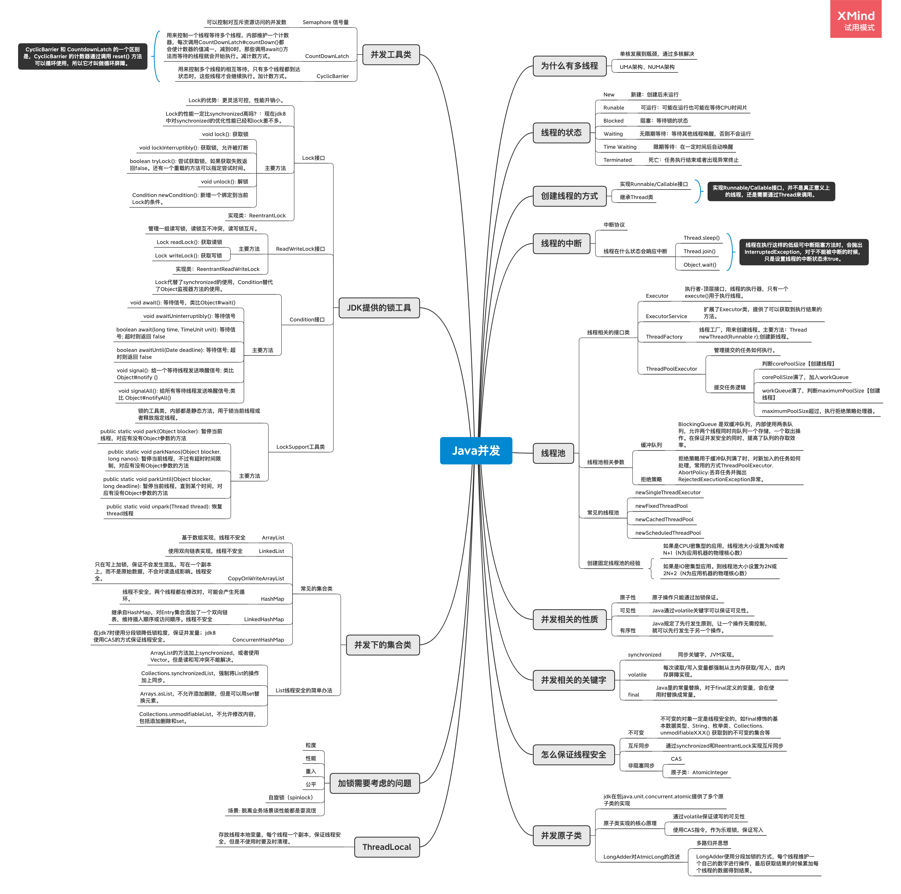

# 学习笔记

## 作业二：思考有多少种方式，在 main 函数启动一个新线程，运行一个方法，拿到这个方法的返回值后，退出主线程？

* 方式一：通过Callable + FutureTask + Thread实现线程调用并获取处理结果。
  代码：[ModeOne](../thread-code/src/main/java/com/wkk/learn/java/thread/homework/ModeOne.java)

* 方式二：通过Callable + 线程池的形式实现线程调用并获取处理结果。
  代码：[ModeTwo](../thread-code/src/main/java/com/wkk/learn/java/thread/homework/ModeTwo.java)

* 方式三：通过自定义Runnable + Future + 线程池的形式实现线程调用并获取处理结果。
  代码：[ModeThree](../thread-code/src/main/java/com/wkk/learn/java/thread/homework/ModeThree.java)

* 方式四：通过ForkJoin实现线程调用并获取处理结果。
  代码：[ModeFour](../thread-code/src/main/java/com/wkk/learn/java/thread/homework/ModeFour.java)

* 方式五：通过CompletableFuture实现线程调用并获取处理结果
  代码：[ModeFive](../thread-code/src/main/java/com/wkk/learn/java/thread/homework/ModeFive.java)

## 作业六：把多线程和并发相关知识带你梳理一遍，画一个脑图，截图上传到 Github 上。

