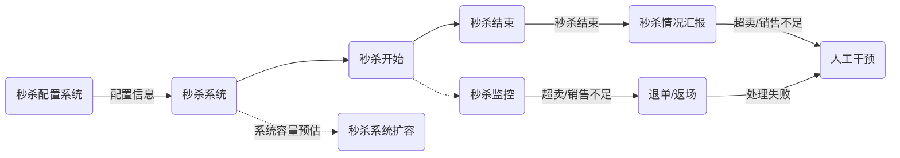

## 1、（必做）针对课上讲解的内容，自己动手设计一个高并发的秒杀系统，将架构图， 设计文档等，提交到github。

### 1.关键需求

&nbsp;&nbsp;&nbsp;&nbsp;实现商品秒杀功能，对少量的商品进行秒杀，吸引大量用户关注与参与，给平台带来可观的流量，以及周边商品的销量提升。

### 2.需求分析

#### 2.1 功能性需求

##### 2.1.1 商品秒杀配置

**需求说明**

&nbsp;&nbsp;&nbsp;&nbsp;随着业务的发展，后续会有很多秒杀业务，不同的秒杀业务，秒杀规则不同。要求系统要支持灵活的秒杀配置，比如用户过滤配置、单个用户商品秒杀数量限制、商品折扣、商品库存等配置。

**分析解决**

&nbsp;&nbsp;&nbsp;&nbsp;秒杀配置功能一般并发量不大，与具体的秒杀相关小，可以单独作为一个应用部署。对于通用的秒杀配置，比如用户过滤、用户秒杀数量限制、商品折扣方式、商品库存等可以作为配置的内置功能提供，秒杀配置时可以直接选择配置；秒杀的配置规则支持扩展，使用插件的方式实现自定义规则的定义。

&nbsp;&nbsp;&nbsp;&nbsp;需要注意的是，秒杀中对用户进行规则校验是否符合秒杀配置的规则需要消耗一定的时间，会一定程度降低秒杀系统的性能。可以对配置条件提前进行缓存预热，解决配置条件查询DB的耗时。在对于某些限定条件下，比如只允许预约的用户才能抢购，可以在秒杀开始前，提前将有秒杀资格的用户id存储到缓存系统中，减少秒杀配置规则的校验。

##### 2.1.2 超时订单返场

**需求说明**

&nbsp;&nbsp;&nbsp;&nbsp;对超时订单支持商品返场功能，抢购用户在商品详情页面可以看到提示，提示用户当前有部分用户超时未支付，仍有机会抢购。

**分析解决**

&nbsp;&nbsp;&nbsp;&nbsp;未支付成功的订单视为抢购中，冻结响应的库存，商品抢购页面如果检查到有冻结的库存，提示用户还有机会可以抢购。对于在指定时间内未支付的订单，系统自动取消并释放冻结的库存。对排队中的用户按照顺序进行抢购。

##### 2.1.3 超卖或销售不足

**需求说明**

&nbsp;&nbsp;&nbsp;&nbsp;保证超卖或销售不足的出现率低于xx%，对于特定的商品（比如库存明确、价值巨大的商品）不允许超卖。

**分析解决**

&nbsp;&nbsp;&nbsp;&nbsp;通过使用同步锁或者分布式锁，实现抢购的减库存操作，保证库存操作的并发安全。通过秒杀的监控，如果出现超卖或者销售不足，进行程序自动取消订单和返场，或者提醒对应的人员，支持界面上的人工干预。

##### 2.1.4 防秒杀器

**需求说明**

&nbsp;&nbsp;&nbsp;&nbsp;防止秒杀器对商品抢购成功，造成用户抢购不公平的现象。

**分析解决**

&nbsp;&nbsp;&nbsp;&nbsp;对于秒杀器解决方式：

* 1.接入风控系统，监测用户抢购的过程，判定用户是否秒杀器行为，如果是则直接拒绝抢购，否则放行。
* 2.风控系统在不可用的情况下，秒杀系统需要有自己的判定策略：可以在用户提交订单成功后，支付时再检测用户是否是秒杀器行为，如果是直接取消订单，释放库存，否则放行。

##### 2.1.5 兜底策略

**需求说明**

&nbsp;&nbsp;&nbsp;&nbsp;在出现始料未及的并发时，要求系统有兜底策略，能以较低的限度完成秒杀活动。

**分析解决**

&nbsp;&nbsp;&nbsp;&nbsp;如果出现大量用户抢购请求，秒杀系统压力极大接近崩溃时，秒杀系统自动进行服务降级：将用户订单的后续处理暂时放到消息中间件中，通过消息中间件削峰填谷；如果还是压力很大，将限制请求数量，在网关或程序中，直接随机拒绝一部分请求。

##### 2.1.6 秒杀的监控

**需求说明**

&nbsp;&nbsp;&nbsp;&nbsp;在商品秒杀完成后，对商品秒杀情况进行统计，对出现超卖或者销售不足的商品，及时通知对应负责人，该返场的返场，该退单的退单。

**分析解决**

&nbsp;&nbsp;&nbsp;&nbsp;在商品秒杀中，如果商品库存抢购完了，系统自动检查是否有超卖或销售不足的问题。

&nbsp;&nbsp;&nbsp;&nbsp;对于超卖，如果秒杀配置中设置了超卖时允许系统自动退单，则系统按照下单时间，取消对应的订单，并通知用户。

&nbsp;&nbsp;&nbsp;&nbsp;对于销售不足，如果秒杀配置中设置了销售不足允许系统自动返场，则系统直接放出剩余的库存数，允许用户进行抢购。

&nbsp;&nbsp;&nbsp;&nbsp;每个商品的秒杀活动都有时间限制，在秒杀结束后，系统会收集统计商品秒杀的情况。如果出现超卖，处理方式和上面超卖的处理一致。如果出现销售不足，因为秒杀已经结束不能进行返场，所以需要通知对应的人员进行人工干预。

#### 2.2 非功能性需求

##### 2.2.1 伸缩性

要求系统在大量秒杀活动或秒杀活动减少时，支持快速的伸缩性，以此减少资源占用。

##### 2.2.2 可靠性

系统的故障处理，最大不能超过xx秒，连续正常运行不得低于xxx小时。

##### 2.2.3 性能

系统99%响应时间不得低于xxx毫秒，最大响应时间不得超过xxx秒。

### 3.技术选型和实现策略

#### 3.1 技术路线选型原则

* 程序使用多层架构、动静分离、可以快速水平扩展。
* 中间件选型原则：扩展性好、成熟热门。
* 数据库选型原则：符合互联网发展趋势、可靠性好、支持集群化部署。
* 对外接口使用统一数据格式、支持多语言。

#### 3.2 系统业务架构

#### 3.3 系统技术架构

#### 3.4 实现策略

##### 3.4.1 秒杀功能设计方案

&nbsp;&nbsp;&nbsp;&nbsp;秒杀功能是秒杀系统的核心功能，要支持高并发。主要的设计思路就是尽量减少共享资源的锁定。

&nbsp;&nbsp;&nbsp;&nbsp;在秒杀中，将库存量均匀存储到redis集群中，通过每个或几个秒杀应用连接到一个redis实例进行减库存操作，降低所有实例访问同一个redis实例的产生的性能问题。

&nbsp;&nbsp;&nbsp;&nbsp;通过在秒杀前，收集秒杀商品详情的UV数量或者关注量（限于只有关注才能抢购的商品），提前预测商品秒杀的并发量。对于超过一定阈值的秒杀商品，提前生成商品的静态详情页，这样避免在抢购时，进行大量查询请求，给系统造成更多压力。

&nbsp;&nbsp;&nbsp;&nbsp;如果在同一时刻，有多个商品秒杀活动，超过应用设计性能时，对应用进行降级。对用户下单成功后的订单处理（物流，运费等），发送到kafka集群中，通过系统异步处理。这样缩短用户请求在系统内的延迟，使得秒杀系统有更多时间去处理秒杀请求。

&nbsp;&nbsp;&nbsp;&nbsp;秒杀商品剩余数量的显示：由于秒杀商品的数量分布在reids集群中，每次统计剩余数量即费时又影响系统的并发量，这个数量不是特别重要的数据，可以不显示，或者一直显示为秒杀配置的商品数量，在秒杀结束后再更新商品数量。

##### 3.4.2 秒杀配置功能设计方案

&nbsp;&nbsp;&nbsp;&nbsp;秒杀配置，对现有的业务规则进行实现，包括：

* 用户规则：只有指定级别的用户才可以抢购。
* 商品规则：只有关注商品才可以抢购、过往的秒杀活动中已抢购成功不能再抢购。
* 数量规则：限制每个用户的抢购数量。
* ...

&nbsp;&nbsp;&nbsp;&nbsp;随着业务演化可能出现新的配置需求，新加配置需求使用模板方法和SPI的形式，注册到应用中。

&nbsp;&nbsp;&nbsp;&nbsp;秒杀配置配置完成后，通过消息中间件kafka将配置信息发送到秒杀系统中。秒杀系统在收到消息后，将秒杀信息保存到db表t中，并通过每15分钟执行一次的定时任务扫描表t，查询出未来15分钟内要开始的秒杀任务。由于秒杀配置后面就不会变了，所以在定时任务中也将秒杀配置的信息缓存到redis集群中，这样秒杀系统查询秒杀配置信息可以直接从缓存中获取到，降低查数据库的延迟。

### 记录（与正文无关）

* redis分片集群
* 系统监控，监控超卖或销售不足
* 对超卖的容忍度
* 对订单超时未支付，货物需要返场。
* 如果使用redis分片集群，类似内存分片的方式保存库存。最后出现访问不均匀会出现销售不足怎么办？
* 服务的设计容量和能力
* 对出现请求量过大的兜底策略
* 如何压测服务
* 对于秒杀商品分级处理，预测请求量，热门商品需要更多的资源，非热门的商品进行秒杀，量较小。通过预约才能抢购，这样可以预测用户量。或者通过商品详情页的UV预测用户量。
* 秒杀平台的配置。
* 避免同一时间大量的商品进行秒杀活动。
* 防秒杀器